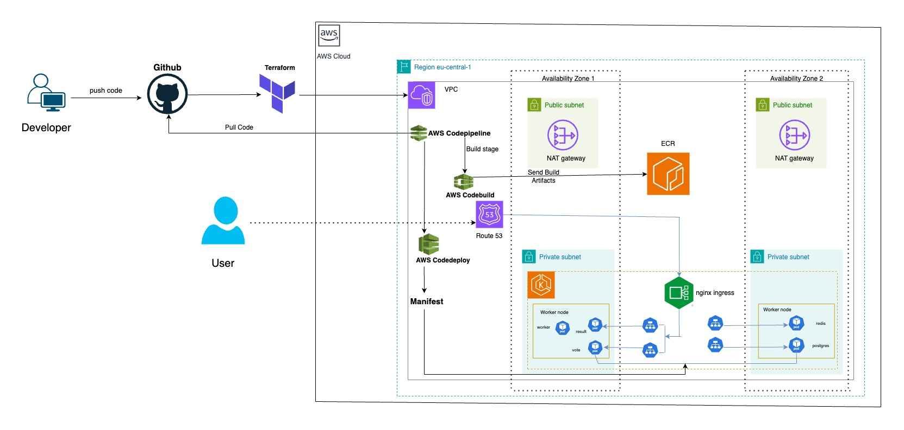

# Deploying the Example Voting App on AWS

## introduction

Hey there! I’m super excited to share my insights for this assignment on deploying Example Voting App on Amazon Web service (AWS).

where I dive into deploying Docker's Example Voting App on AWS EKS(Elastic Kubernetes Service). The idea here is to show off how Kubernetes can really shine in a microservices architecture. I used Terraform to set up the infrastructure, AWS ECR(Elastic Container Service) for storing container images, and Nginx Ingress Controller to handle external access. Plus, I've automated the whole process using AWS CodePipeline for continuous integration and deployment.

I tweaked some manifest files, wrote Terraform code to spin up the infrastructure on AWS, and Added CI/CD workflows that deploys everything on an AWS EKS cluster

## Technical Architecture

Here’s a quick breakdown of the DevOps tools and AWS services I used to build and deploy the example voting app:

1. **Terraform:** Handles the deployment of the AWS EKS cluster and other required AWS resources.
2. **GitHub:** Where all the code for the app is stored.
3. **AWS CodePipeline:** Automates the CI/CD process, building and deploying the app on the EKS cluster.
4. **Nginx Ingress Controller:** Manages external access by setting up a network load balancer on AWS.
5. **AWS EKS:** The managed Kubernetes service on AWS.
6. **Amazon VPC:** Hosts the EKS cluster along with all the networking components needed.
7. **AWS ECR:** A private container registry for storing Docker images (like Docker Hub, but on AWS).
8. **AWS Route 53:** AWS’s DNS service.
9. **AWS Certification Manager:** Provides SSL certificates for the domain name.

## Scenario 1 - Development Environment Setup:

### Exploring Deployment Options.

For the development environment, I needed something that’s suitable for complex, microservices-based applications, and provide control over Kubernetes clusters, cost-effective, and easy to manage. Here’s a quick look at the options I considered within AWS:

1. Amazon EC2 (Elastic Compute Cloud)

   - **What it is:** Provides virtual machines (instances) on AWS.
   - **Use case:** Great if you need complete control over the OS and software stack.
   - **Pros:** High flexibility and control.
   - **Cons:**More hands-on management like patching, scaling, and load balancing.

2. Amazon ECS (Elastic Container Service) with Fargate

   - **What it is:** A fully managed service that runs Docker containers without you needing to manage servers.
   - **Use case:** Ideal for microservices when you don't want the headache of managing infrastructure.
   - **Pros:** No server management, auto-scaling, cost-effective for smaller workloads.
   - **Cons:** Less control over the infrastructure compared to EC2.

3. Amazon EKS (Elastic Kubernetes Service)

   - **What it is:** A managed Kubernetes service that makes it easier to run Kubernetes clusters on AWS.
   - **Use case:** Best for organizations already using Kubernetes or rneed advanced features like self-healing and rolling updates.
   - **Pros:** Full control over Kubernetes clusters, highly scalable, great for complex microservices.
   - **Cons:** Kubernetes can be tricky to manage and has a steeper learning curve compared to ECS.

For our specific use case, I chose Amazon EKS because it gives me full control over the Kubernetes clusters, which is perfect for managing a microservices-based app like the voting app. EKS also scales well and integrates smoothly with other AWS services, making it easier to handle the development environment.

### Infrastructure Set-Up and Application Deployment (CD)

Here’s how we can set up the infrastructure and deploy the app:

#### AWS Infrastructure Setup:

1. **Terraform (Infrastructure as Code):**

   - Setup AWS EKS infrastructure using the terraform, creating necessary VPC, subnets, and security groups.
   - Integrate Route 53 for DNS management, and configure SSL certificates via AWS Certificate Manager.

2. **CI Pipeline with AWS CodeBuild:**
   Lets Use CodePipeline to automate the CI/CD process.

   - Build Docker images for the app’s microservices (vote, result, worker) and Push them to Amazon ECR (Elastic Container Registry).
   - Utilize buildspec-build.yml file in CodeBuild to handle the build and push processes.

#### Deployment Model (Continuous Deployment):

1. CI/CD Pipeline with AWS CodePipeline:

   - **Source Stage:** CodePipeline triggers when code is pushed to GitHub, pulling the latest changes.
   - **Build Stage:** CodeBuild compiles the Docker images and pushes them to ECR.
   - **Deploy Stage:** AWS CodeDeploy runs buildspec-deploy.yml, which uses kubectl
     (to run Kubernetes manifests) to deploy the app to the EKS cluster with the latest images

2. Ingress & DNS Setup:

   - Configured Nginx Ingress Controller for external access.
   - Set up Route 53 to direct traffic to the EKS services using custom domain names secured with SSL.

This setup ensures a fully automated CI/CD pipeline with infrastructure management, all within AWS

> [!NOTE]
> No Downtime Deployment:
> We can use Blue-Green Deployment or Canary Deployment strategies via CodeDeploy.
> Blue-Green: Deploy new version alongside old version, switch traffic after testing.
> Canary: Gradually shift traffic to the new version, monitoring for issues.
